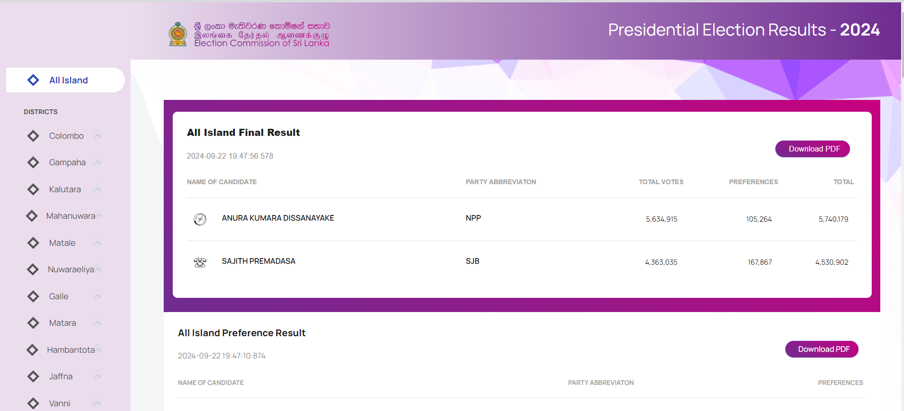
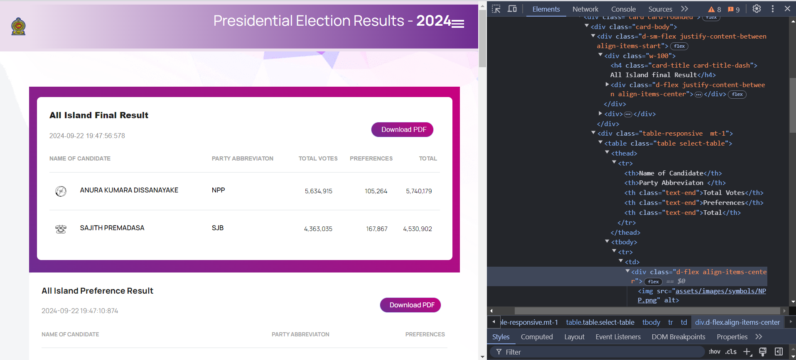
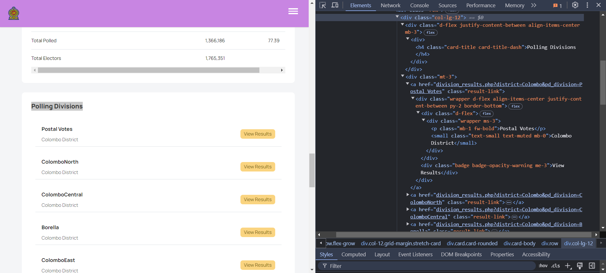
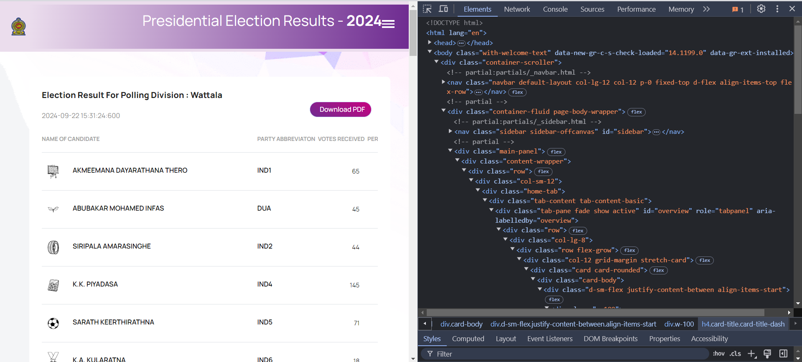

# Build Scraper

## Prerequisites

To follow along with this Python web scraping tutorial, you will need:

- Basic knowledge of how to run commands on a terminal.
- Python installed on your machine.
- An IDE capable of running Jupyter Notebook.

You may use a Virtual Private Server (VPS) for larger tasks; however, since this is a small project, I'm using my local machine.

:::tip

If your machine isn't well-suited for Python development, you can use Google Colab to enhance your experience.
:::

## Install Necessary Libraries

To build our web scraper, we need to install some necessary libraries. Open your terminal or command prompt and ensure that your virtual environment is activated. Then, run the following command:

```bash
pip install requests beautifulsoup4 pandas
```

This command will install the following libraries:

- **requests**: To send HTTP requests to the website.
- **BeautifulSoup**: To parse HTML and extract data.
- **pandas**: To manage and analyze the data.

Once the installation is complete, you are ready to proceed with building the scraper!

## Making the First Request

Now that we have installed the necessary libraries, let's make our first request to the election results website: [https://results.elections.gov.lk/](https://results.elections.gov.lk/).



### Step 1: Sending an HTTP Request

We will use the `requests` library to send an HTTP GET request to the website. Create a new code cell in your Jupyter Notebook and add the following code:

```python
import requests

url = "https://results.elections.gov.lk/"
response = requests.get(url)

if response.status_code == 200:
    print("Successfully fetched the webpage!")
else:
    print(f"Failed to retrieve the webpage. Status code: {response.status_code}")
```

### Step 2: Understanding the Response

When you run the code, you should see a message indicating whether the request was successful. If the status code is 200, it means the request was successful, and you have access to the webpage content.

In this section, we successfully made our first HTTP request to the election results website. In the next step, we will parse the HTML content to extract the election results data.

## Extracting Data with Beautiful Soup

Now that we have successfully fetched the webpage, we can use Beautiful Soup to parse the HTML and extract the election results data.

### Step 1: Parsing the HTML Content

First, we need to import the `BeautifulSoup` class from the `bs4` module and parse the HTML content we received from the website. Add the following code to your Jupyter Notebook:

```python
from bs4 import BeautifulSoup

# Parse the HTML content
soup = BeautifulSoup(response.text, 'html.parser')

# Print the title of the webpage to confirm parsing
print(soup.title.text)
```

it'll print the title of the website as **Live Sri Lanka Presidential Election Results 2024 | Real-Time Results**

## Extracting Data from the Home Page

Now that we have made a request to the election results website, we will extract the relevant election result data from the home page. The data includes the final results, preference results, and vote counts.

### Step 1: Inspecting the HTML Structure

Before extracting data, inspect the HTML structure of the page to find where the relevant information is located. You can do this by right-clicking on the page and selecting "Inspect" to open the Developer Tools.



### Step 2: Extracting All Island Final Results

We will first extract the "All Island Final Result." This includes candidates' names, parties, total votes, preferences, and the overall total.

Add the following code to your Jupyter Notebook to extract this data:

```python
# Extracting All Island Final Results
all_island_results_section = soup.find('h4', text='All Island final Result').find_next('table')

all_island_results = []
for row in all_island_results_section.find_all('tr')[1:]:  # Skip the header row
    columns = row.find_all('td')
    if len(columns) > 0:
        candidate = columns[0].text.strip()
        party = columns[1].text.strip()
        total_votes = columns[2].text.strip().replace(',', '')
        preferences = columns[3].text.strip().replace(',', '')
        total = columns[4].text.strip().replace(',', '')

        all_island_results.append({
            'candidate': candidate,
            'party': party,
            'total_votes': int(total_votes),
            'preferences': int(preferences),
            'total': int(total)
        })

# Display the extracted All Island results
for result in all_island_results:
    print(result)
```

and you'll get the output as

```bash
{'candidate': 'ANURA KUMARA DISSANAYAKE', 'party': 'NPP', 'total_votes': 5634915, 'preferences': 105264, 'total': 5740179}
{'candidate': 'SAJITH PREMADASA', 'party': 'SJB', 'total_votes': 4363035, 'preferences': 167867, 'total': 4530902}
```

### Step 3: Extracting Preference Results

Next, we will extract the "All Island Preference Result," which includes candidates and their preference counts. Use the following code:

```python
# Extracting All Island Preference Results
preference_results_section = soup.find('h4', text='All Island Preference Result').find_next('table')

preference_results = []
for row in preference_results_section.find_all('tr')[1:]:  # Skip the header row
    columns = row.find_all('td')
    if len(columns) > 0:
        candidate = columns[0].text.strip()
        party = columns[1].text.strip()
        preferences = columns[2].text.strip().replace(',', '')

        preference_results.append({
            'candidate': candidate,
            'party': party,
            'preferences': int(preferences)
        })

# Display the extracted Preference results
for result in preference_results:
    print(result)
```

and you'll get the output as

```bash
{'candidate': 'ANURA KUMARA DISSANAYAKE', 'party': 'NPP', 'preferences': 105264}
{'candidate': 'SAJITH PREMADASA', 'party': 'SJB', 'preferences': 167867}
```

### Step 4: Extracting Data from All Island Results

In this section, we will extract detailed election results from the "All Island Results" section of the election results website. This data includes the names of candidates, their party affiliations, the votes they received, and the corresponding percentage of total votes.

To extract the All Island Results, we will locate the relevant section on the webpage and parse the data from the corresponding HTML table. Below is the code to accomplish this:

```python
# Extracting All Island Results
all_island_results_section = soup.find('h4', text='All Island Results')

# Check if the section is found
if all_island_results_section is not None:
    all_island_results_section = all_island_results_section.find_next('table')

    all_island_results = []
    for row in all_island_results_section.find_all('tr')[1:]:  # Skip the header row
        columns = row.find_all('td')
        if len(columns) > 0:
            candidate = columns[0].text.strip()
            party = columns[1].text.strip()
            votes_received = columns[2].text.strip().replace(',', '')
            percentage = columns[3].text.strip()

            all_island_results.append({
                'candidate': candidate,
                'party': party,
                'votes_received': int(votes_received),
                'percentage': percentage
            })

    # Display the extracted All Island results
    print("\nExtracted All Island Results:")
    for result in all_island_results[:5]:  # Print first 5 results
        print(f"Candidate: {result['candidate']}, Party: {result['party']}, Votes Received: {result['votes_received']}, Percentage: {result['percentage']}")
else:
    print("Section 'All Island Results' not found.")

```

and you'll get the output as

```bash
Extracted All Island Results:
Candidate: ANURA KUMARA DISSANAYAKE, Party: NPP, Votes Received: 5634915, Percentage: 42.31%
Candidate: SAJITH PREMADASA, Party: SJB, Votes Received: 4363035, Percentage: 32.76%
Candidate: RANIL WICKREMESINGHE, Party: IND16, Votes Received: 2299767, Percentage: 17.27%
Candidate: NAMAL RAJAPAKSA, Party: SLPP, Votes Received: 342781, Percentage: 2.57%
Candidate: ARIYANETHIRAN PAKKIYASELVAM, Party: IND9, Votes Received: 226343, Percentage: 1.7%
```

In this section, we successfully extracted the "All Island Final Results", "All Island Preference Results" and detailed "All Island Results" from the homepage of the election results website. In the next section, we will explore how to save this data for further analysis and visualization.

### Step 5: Saving the Output

Next, we will save the extracted data from all three sections (Final Results, Preference Results, and All Island Results) into CSV files for further analysis. The following code will combine all the data into a single DataFrame and then save it using the `pandas` library.

```python
import pandas as pd

# Combine the results into a single DataFrame
final_results_df = pd.DataFrame(all_island_results)
preference_results_df = pd.DataFrame(preference_results)

# Save All Island Results to CSV
final_results_df.to_csv('all_island_results.csv', index=False)

# Save Preference Results to CSV
preference_results_df.to_csv('preference_results.csv', index=False)

# Optionally, print confirmation messages
print("All Island Results saved to 'all_island_results.csv'")
print("Preference Results saved to 'preference_results.csv'")
```

:::note

Ensure that you have the `pandas` library installed. If you haven't installed it yet, you can do so using pip:

```bash
pip install pandas
```

:::

### Step 6: Extracting Additional Voting Details

We will extract the details about valid votes, rejected votes, total polled, and total electors from the relevant section on the webpage. Here’s how to implement this:

```python
# Extracting Voting Details
voting_details_section = soup.find(text='Valid Votes').find_parent('table')

# Initialize a dictionary to hold voting details
voting_details = {}

# Extract details from the voting details section
if voting_details_section is not None:
    rows = voting_details_section.find_all('tr')

    for row in rows:
        columns = row.find_all('td')
        if len(columns) > 0:
            label = columns[0].text.strip()
            value = columns[1].text.strip().replace(',', '')
            voting_details[label] = int(value)

# Display the extracted voting details
for key, value in voting_details.items():
    print(f"{key}: {value}")
```

This will provide you with the output similar to the following:

```bash
Valid Votes: 13319616
Rejected Votes: 300300
Total Polled: 13619916
Total Electors: 17140354
```

If you wish to save this additional voting details into a CSV file as well, you can extend the previous saving code like this:

```python
# Convert voting details to a DataFrame
voting_details_df = pd.DataFrame(list(voting_details.items()), columns=['Detail', 'Value'])

# Save Voting Details to CSV
voting_details_df.to_csv('voting_details.csv', index=False)

# Confirmation message
print("Voting details saved to 'voting_details.csv'")
```

:::info

- We use the `find_parent()` method to locate the parent table of the "Valid Votes" text to grab the necessary voting information.
- A dictionary named `voting_details` is created to hold the extracted values.
- Finally, we save the details into a CSV file using the `to_csv()` function from the `pandas` library.

:::

## Extract Data for Districts

### Step 1: Creating a List of Districts for Preference Data Extraction

To extract district-wise preference data from the URL `https://results.elections.gov.lk/district_preference.php?district=Colombo`, we can create a small list of districts and iterate over it to scrape data for each district.

We will first define a list of districts and then loop through each district to construct the appropriate URL and scrape the preference data. Here’s the code to achieve this:

```python
import requests
from bs4 import BeautifulSoup
import pandas as pd

# List of districts to scrape preference data
districts = [
    "Colombo", "Gampaha", "Kalutara", "Mahanuwara", "Matale",
    "Nuwaraeliya", "Galle", "Matara", "Hambantota", "Jaffna",
    "Vanni", "Batticaloa", "Digamadulla", "Trincomalee", "Kurunegala",
    "Puttalam", "Anuradhapura", "Polonnaruwa", "Badulla",
    "Monaragala", "Ratnapura", "Kegalle"
]

# Initialize a list to hold preference results for all districts
all_district_results = []

# Loop through each district to extract preference data
for district in districts:
    # Construct the URL for each district
    url = f"https://results.elections.gov.lk/district_preference.php?district={district}"

    # Make a request to the URL
    response = requests.get(url)

    # Check if the request was successful
    if response.status_code == 200:
        soup = BeautifulSoup(response.text, 'html.parser')

        # Extracting preference results for each district
        preference_results_section = soup.find('h4', text=f'District Preference Result of {district}').find_next('table')

        # Extract the data from the table
        if preference_results_section is not None:
            for row in preference_results_section.find_all('tr')[1:]:  # Skip the header row
                columns = row.find_all('td')
                if len(columns) > 0:
                    candidate = columns[0].text.strip()
                    party = columns[1].text.strip()
                    preferences = columns[2].text.strip().replace(',', '')

                    all_district_results.append({
                        'district': district,
                        'candidate': candidate,
                        'party': party,
                        'preferences': int(preferences)
                    })
    else:
        print(f"Failed to retrieve data for {district}")

# Convert the results to a DataFrame and save to CSV
district_results_df = pd.DataFrame(all_district_results)
district_results_df.to_csv('district_preference_results.csv', index=False)

# Confirmation message
print("District preference results saved to 'district_preference_results.csv'")
```

#### Explanation

1. **List of Districts**: A list of districts is created to iterate through.
2. **Loop Through Districts**: For each district, the appropriate URL is constructed, and an HTTP GET request is made.
3. **Data Extraction**: If the request is successful, the BeautifulSoup library is used to parse the HTML and extract preference results from the relevant section.
4. **Data Storage**: The extracted data for each candidate in each district is appended to the `all_district_results` list.
5. **Saving to CSV**: Finally, the results are converted into a Pandas DataFrame and saved as a CSV file named `district_preference_results.csv`.

The script will create a CSV file that includes the district, candidate, party, and their preference count for each district listed.

### Step 2: Extracting Postal Votes for Each District

To scrape postal votes for each district from the given URL `https://results.elections.gov.lk/division_results.php?district=Colombo&pd_division=Postal%20Votes`, we will loop through the districts just like we did with preference results. The process is similar, but this time, we will retrieve data for postal votes.

Here’s the Python code for this step:

```python
# List of districts to scrape postal votes data
districts = [
    "Colombo", "Gampaha", "Kalutara", "Mahanuwara", "Matale",
    "Nuwaraeliya", "Galle", "Matara", "Hambantota", "Jaffna",
    "Vanni", "Batticaloa", "Digamadulla", "Trincomalee", "Kurunegala",
    "Puttalam", "Anuradhapura", "Polonnaruwa", "Badulla",
    "Monaragala", "Ratnapura", "Kegalle"
]

# Initialize a list to hold postal votes results for all districts
all_postal_votes_results = []

# Loop through each district to extract postal votes data
for district in districts:
    # Construct the URL for postal votes in each district
    url = f"https://results.elections.gov.lk/division_results.php?district={district}&pd_division=Postal%20Votes"

    # Make a request to the URL
    response = requests.get(url)

    # Check if the request was successful
    if response.status_code == 200:
        soup = BeautifulSoup(response.text, 'html.parser')

        # Extract postal votes for each district
        postal_votes_section = soup.find('h4', text=f'Election Result for {district} District: Postal Votes').find_next('table')

        # Extract the data from the table
        if postal_votes_section is not None:
            for row in postal_votes_section.find_all('tr')[1:]:  # Skip the header row
                columns = row.find_all('td')
                if len(columns) > 0:
                    candidate = columns[0].text.strip()
                    party = columns[1].text.strip()
                    votes_received = columns[2].text.strip().replace(',', '')

                    all_postal_votes_results.append({
                        'district': district,
                        'candidate': candidate,
                        'party': party,
                        'votes_received': int(votes_received)
                    })
    else:
        print(f"Failed to retrieve data for {district}")

# Convert the results to a DataFrame and save to CSV
postal_votes_df = pd.DataFrame(all_postal_votes_results)
postal_votes_df.to_csv('postal_votes_results.csv', index=False)

# Confirmation message
print("Postal votes results saved to 'postal_votes_results.csv'")
```

#### Explanation

1. **List of Districts**: The same list of districts is used to loop through each one.
2. **Constructing the URL**: The URL for each district's postal votes data is constructed by appending the district name and `pd_division=Postal%20Votes`.
3. **Data Extraction**: The script checks if the "Postal Votes Result" table exists and extracts data for each candidate, including the number of votes received.
4. **Saving to CSV**: The extracted data is stored in a Pandas DataFrame and saved as `postal_votes_results.csv`.

The script will create a CSV file (`postal_votes_results.csv`) that includes postal votes data for each candidate across all districts.

## Extracting Data for Polling Divisions

Firts we'll create a dataset about the available polling divisions for each district

### Step 1: Extracting Polling Divisions for Each District

To scrape the polling divisions for a district from this HTML structure, we need to extract the names of the divisions along with their links.



Here's the code for scraping script that will work with this HTML structure and get the polling divisions and their corresponding URLs:

```python
# Initialize a list to hold polling divisions for all districts
all_polling_divisions = []

# Base URL
base_url = "https://results.elections.gov.lk"

# Loop through each district to extract polling divisions data
for district in districts:
    # Construct the URL for each district
    url = f"https://results.elections.gov.lk/district_results.php?district={district}"


    # Check if the request was successful
    if response.status_code == 200:
        soup = BeautifulSoup(response.text, 'html.parser')

        # Extract polling divisions from the section with the h4 heading "Polling Divisions"
        polling_divisions_section = soup.find('h4', text='Polling Divisions')

        if polling_divisions_section is not None:
            polling_divisions_links = polling_divisions_section.find_next('div', class_='mt-3').find_all('a', class_='result-link')

            # Extract the data from the links
            for link in polling_divisions_links:
                division_name = link.find('p', class_='fw-bold').text.strip()

                all_polling_divisions.append({
                    'district': district,
                    'polling_division': division_name,
                })
    else:
        print(f"Failed to retrieve data for {district}")

# Convert the results to a DataFrame and save to CSV
polling_divisions_df = pd.DataFrame(all_polling_divisions)
polling_divisions_df.to_csv('polling_divisions.csv', index=False)

# Confirmation message
print("Polling divisions results saved to 'polling_divisions.csv'")
```

#### Explanation

1. **Polling Divisions Section**: We locate the section with the heading "Polling Divisions" and extract the links inside it.
2. **Link Extraction**: For each polling division, we grab the name and URL (`href`) that points to the division's results.
3. **Store Data**: Each polling division and its URL are stored in a list as a dictionary containing the `district` and `polling_division`.
4. **Save to CSV**: The data is saved in a CSV file `polling_divisions.csv`.

CSV Structure:

```csv
district,polling_division
Colombo,Postal Votes
Colombo,ColomboNorth
...
```

This CSV will contain polling division names and corresponding district.

### Step 2: Extracting Results for each Polling Division

To collect and scrape data from each polling division listed in the `polling_divisions.csv`, we can build a Python script that reads the CSV, constructs the appropriate URL for each polling division, and extracts the election results from the respective page. We'll locate the `h4` tag containing the title "Election Result for Polling Division," then extract the relevant table containing the results.



Here's the script to automate this process:

```python
import csv

# Read the CSV file containing district and polling division data
polling_divisions_df = pd.read_csv('polling_divisions.csv')

# Base URL
base_url = "https://results.elections.gov.lk/division_results.php"

# Initialize a list to hold the election result data
election_results = []

# Function to scrape data from each polling division
def scrape_polling_division_data(district, polling_division):
    # Construct the URL for the polling division
    url = f"{base_url}?district={district}&pd_division={polling_division.replace(' ', '%20')}"

    # Send a request to the URL
    response = requests.get(url)

    if response.status_code == 200:
        soup = BeautifulSoup(response.text, 'html.parser')

        # Set title format based on whether it's postal votes or not
        if polling_division == "Postal Votes":
            h4_title = soup.find('h4', text=f'Election Result for {district} District: {polling_division}')
        else:
            h4_title = soup.find('h4', text=f'Election Result for Polling Division : {polling_division}')

        if h4_title:
            # Find the table containing the results (assuming it's the first table after the h4)
            results_table = h4_title.find_next('table')

            if results_table:
                # Extract rows from the table
                for row in results_table.find_all('tr')[1:]:  # Skip the header row
                    columns = row.find_all('td')
                    if len(columns) > 0:
                        candidate = columns[0].text.strip()
                        party = columns[1].text.strip()
                        votes = columns[2].text.strip().replace(',', '')
                        percentage = columns[3].text.strip()

                        # Append the data to the election_results list
                        election_results.append({
                            'district': district,
                            'polling_division': polling_division,
                            'candidate': candidate,
                            'party': party,
                            'votes': int(votes),
                            'percentage': percentage
                        })
        else:
            print(f"Title not found for {polling_division}")
    else:
        print(f"Failed to retrieve data for {polling_division} in {district}")

# Loop through each polling division and scrape the data
for index, row in polling_divisions_df.iterrows():
    district = row['district']
    polling_division = row['polling_division']
    print(f"Scraping data for {polling_division} in {district}...")
    scrape_polling_division_data(district, polling_division)

# Save the election results to a CSV file
with open('polling_division_results.csv', mode='w', newline='') as file:
    writer = csv.DictWriter(file, fieldnames=['district', 'polling_division', 'candidate', 'party', 'votes', 'percentage'])
    writer.writeheader()
    writer.writerows(election_results)

print("Election results saved to 'polling_division_results.csv'")

```

#### Explanation of the Script

1. **Reading CSV**: We first read the `polling_divisions.csv` file, which contains the district and polling division names.
2. **Constructing URLs**: For each polling division, the URL is constructed by concatenating the base URL with the district and polling division, replacing any spaces in the division name with `%20` for the URL encoding.

3. **Scraping Data**:

   - The script sends an HTTP request to each polling division's URL.
   - It locates the `h4` title using the format "Election Result for Polling Division : [PollingDivisionName]".
   - It scrapes the data from the first table after this title, assuming it contains the election results.

4. **Storing Results**: The results for each candidate (including district, polling division, candidate name, party, votes, and percentage) are appended to the `election_results` list.

5. **Saving Results to CSV**: Once all polling divisions are processed, the results are saved to a file named `polling_division_results.csv`.

#### Expected CSV Output (`polling_division_results.csv`)

```csv
district,polling_division,candidate,party,votes,percentage
Colombo,ColomboNorth,Candidate A,Party A,12345,50.5%
Colombo,ColomboNorth,Candidate B,Party B,6789,27.3%
...
```

This CSV will contain the election results for all candidates from all the polling divisions in the specified districts.

### Step 3: Extracting Additional Voting Details

We will extract the details about valid votes, rejected votes, total polled, and total electors from the relevant section on the webpage. Here’s how to implement this:

```python

# Read the CSV file containing district and polling division data
polling_divisions_df = pd.read_csv('polling_divisions.csv')

# Base URL
base_url = "https://results.elections.gov.lk/division_results.php"

# Initialize a list to hold the additional details
additional_details = []

# Function to scrape voting details from each polling division
def scrape_voting_details(district, polling_division):
    # Construct the URL for the polling division
    url = f"{base_url}?district={district}&pd_division={polling_division.replace(' ', '%20')}"

    # Send a request to the URL
    response = requests.get(url)

    if response.status_code == 200:
        soup = BeautifulSoup(response.text, 'html.parser')

        # Extract voting details (valid votes, rejected votes, etc.)
        voting_details_section = soup.find(text='Valid Votes').find_parent('table')

        # Initialize a dictionary to hold voting details
        voting_details = {}

        # Extract details from the voting details section
        if voting_details_section is not None:
            rows = voting_details_section.find_all('tr')

            for row in rows:
                columns = row.find_all('td')
                if len(columns) > 0:
                    label = columns[0].text.strip()
                    value = columns[1].text.strip().replace(',', '')
                    voting_details[label] = int(value)

            # Append additional data to the additional_details list
            additional_details.append({
                'district': district,
                'polling_division': polling_division,
                'valid_votes': voting_details.get('Valid Votes', 0),
                'rejected_votes': voting_details.get('Rejected Votes', 0),
                'total_polled': voting_details.get('Total Polled', 0),
                'total_electors': voting_details.get('Total Electors', 0)
            })
        else:
            print(f"Warning: Voting details table not found for {polling_division} in {district}.")

    else:
        print(f"Failed to retrieve data for {polling_division} in {district}. HTTP Status: {response.status_code}")

# Iterate through the polling divisions and scrape voting details
for _, row in polling_divisions_df.iterrows():
    district = row['district']
    polling_division = row['polling_division']
    print(f"Scraping data for {polling_division} in {district}...")

    scrape_voting_details(district, polling_division)

# Convert the list of additional details to a DataFrame and save to CSV
additional_details_df = pd.DataFrame(additional_details)
additional_details_df.to_csv('additional_polling_details.csv', index=False)

print("Voting details scraping complete and saved to additional_polling_details.csv")
```

#### Key Steps in This Script

1. **Input File:** Reads from `polling_divisions.csv` to get the district and polling division data.
2. **Additional Data:** Scrapes the **Valid Votes**, **Rejected Votes**, **Total Polled**, and **Total Electors** from the results page of each polling division.
3. **Save to CSV:** The extracted additional details are saved in a separate CSV file, `additional_polling_details.csv`.

#### Output CSV File (`additional_polling_details.csv`)

This will generate a file with columns like:

| district | polling_division | valid_votes | rejected_votes | total_polled | total_electors |
| -------- | ---------------- | ----------- | -------------- | ------------ | -------------- |
| Colombo  | Postal Votes     | 102774      | 2526           | 105300       | 138957         |
| Colombo  | ColomboNorth     | ...         | ...            | ...          | ...            |
| ...      | ...              | ...         | ...            | ...          | ...            |

This way, your **additional details** will be neatly stored in a separate CSV file for further analysis or reporting.

### Conclusion

In this tutorial, we successfully scraped comprehensive data from the Sri Lankan Election Commission's website regarding the 2024 presidential election. We extracted key information, including overall election results, preference counts for candidates, district-wise results, and detailed voting statistics for various polling divisions. The structured data we collected is now saved in CSV files, making it readily accessible for further analysis and visualization.

With this data at hand, we can proceed to build an interactive dashboard that will allow users to explore election results in an engaging manner.

Thank you for following along, and let's get started on building our dashboard!
